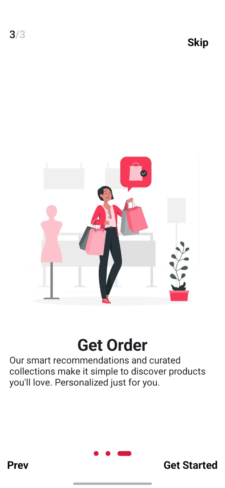
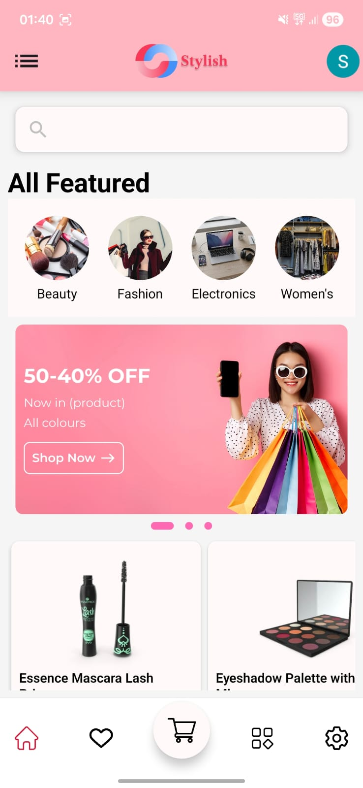
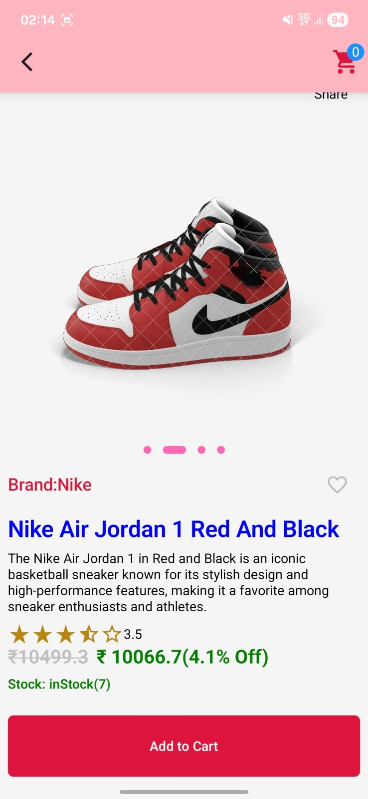
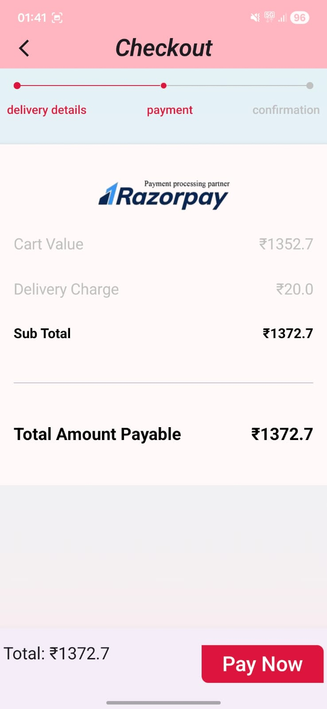

# Stylish - Premium E-Commerce Application 🛍️

**Stylish** is a modern, full-featured Android e-commerce application designed to provide a seamless shopping experience. Built with **Kotlin** and **MVVM Clean Architecture**, it integrates **Firebase Authentication** for secure user management, **Room Database** for local favorite storage, and **Razorpay** for secure payments.
---
## 📱 Screenshots
| Onboarding | Home | Product Details | Cart & Checkout |
|:---:|:---:|:---:|:---:|
|  |  |  |  |
---
## ✨ Key Features
- **🔐 Secure Authentication**: 
  - Login & Sign Up with Email/Password.
  - Social Login integration (Google, Facebook).
  - Forgot Password functionality.
  
- **🏠 Dynamic Home & Discovery**:
  - Featured products slider/carousel.
  - Categorized browsing (Beauty, Fashion, Electronics, etc.).
  - Search functionality for quick product lookup.
- **❤️ Favorites & Wishlist**:
  - **Room Database** integration ensures users can save their favorite items locally for offline access.
  - Instant add/remove functionality from product cards.
- **🛒 Smart Cart & Checkout**:
  - Manage cart items (Update quantities, Remove items).
  - Real-time price calculation (Subtotal, Delivery charges).
  - Multi-step checkout flow (Delivery Address -> Payment -> Confirmation).
- **💳 Secure Payments**:
  - Integrated **Razorpay** Payment Gateway.
  - Supports Cards, UPI, Netbanking, and Wallets.
- **👤 User Profile**:
  - Manage personal details and saved addresses.
  - Order history tracking.
---
## 🛠️ Tech Stack
- **Language**: Kotlin
- **Architecture**: MVVM (Model-View-ViewModel)
- **UI Framework**: JetPack Compose / Material Design Components
- **Local Database**: Room Database (for Favorites/Wishlist)
- **Networking**: Retrofit / Ktor
- **Backend/Auth**: Firebase Authentication & Realtime Database
- **Payment Gateway**: Razorpay
- **Dependency Injection**: Hilt (implied standard)
- **Image Loading**: Coil / Glide
- **Asynchronous**: Coroutines & Flow
---
## 🚀 Getting Started
1.  **Clone the repository**:
    ```bash
    git clone https://github.com/ShashankMahaseth/Stylish-E-Commerce-.git
    ```
2.  **Open in Android Studio**:
    - Select `File > Open` and choose the cloned directory.
3.  **Firebase Setup**:
    - Create a project on [Firebase Console](https://console.firebase.google.com/).
    - Add your `google-services.json` file to the `app/` directory.
    - Enable Authentication (Email/Password, Google).
4.  **Build & Run**:
    - Sync Gradle files.
    - Run the app on an Emulator or Physical Device.
---
## 🤝 Contact
**Shashank Mahaseth**  
- **LinkedIn**: [shashankmahaseth](https://www.linkedin.com/in/shashankmahaseth/)
- **GitHub**: [ShashankMahaseth](https://github.com/ShashankMahaseth)
- **Email**: shashankmahaseth2323@gmail.com
---
_Designed and Developed with ❤️ by Shashank_
